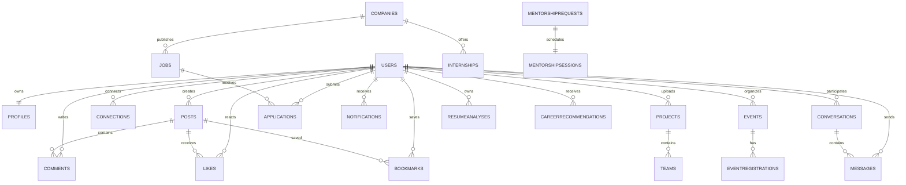

# Entity Relationship Diagram (ERD)

**Project:** CampusBridge

**Version:** 1.0

**Database:** MongoDB Atlas

**Status:** Approved

---

# Overview

This document defines the logical relationships between the collections used in CampusBridge.

Although MongoDB is a NoSQL database, collections are connected using ObjectId references to maintain data consistency while preserving flexibility.

The ERD serves as the blueprint for database schema design, API development, and backend implementation.

---

# Primary Collections

## Identity

- Users
- Profiles
- Skills
- Education
- Experience
- Achievements
- Portfolios

---

## Community

- Posts
- Comments
- Likes
- Bookmarks
- Connections
- Clubs
- Announcements

---

## Career

- Companies
- Jobs
- Internships
- Applications
- Referrals

---

## Alumni

- MentorshipRequests
- MentorshipSessions
- MentorAvailability

---

## Campus

- Projects
- Teams
- Events
- EventRegistrations
- Hackathons

---

## Communication

- Conversations
- Messages
- Notifications

---

## Artificial Intelligence

- ResumeAnalyses
- SkillGapReports
- CareerRecommendations
- ProjectRecommendations

---

## Administration

- Reports
- AuditLogs

---

# High-Level Entity Relationship Diagram



---

# User Relationships

A user is the central entity in CampusBridge.

One user can have:

- One profile
- Multiple posts
- Multiple projects
- Multiple applications
- Multiple notifications
- Multiple messages
- Multiple AI reports

Relationship summary

```text
Users

1 → 1 Profile

1 → N Posts

1 → N Projects

1 → N Comments

1 → N Applications

1 → N Notifications

1 → N Messages

1 → N ResumeAnalyses
```

---

# Community Relationships

```text
Posts

1 → N Comments

1 → N Likes

1 → N Bookmarks
```

---

# Career Relationships

```text
Company

1 → N Jobs

1 → N Internships
```

```text
Job

1 → N Applications
```

---

# Mentorship Relationships

```text
Mentor

1 → N Mentorship Requests

1 → N Sessions
```

```text
Student

1 → N Requests
```

---

# Event Relationships

```text
Event

1 → N Registrations
```

```text
Student

1 → N Registrations
```

---

# Chat Relationships

```text
Conversation

1 → N Messages
```

```text
User

1 → N Conversations
```

---

# AI Relationships

```text
User

1 → N Resume Analyses

1 → N Skill Gap Reports

1 → N Career Recommendations

1 → N Project Recommendations
```

---

# Administration Relationships

```text
User

1 → N Reports
```

```text
Administrator

1 → N Audit Logs
```

---

# Reference Strategy

CampusBridge uses MongoDB ObjectId references for related collections.

Examples:

| Collection | Reference |
|------------|-----------|
| Profiles | userId |
| Posts | authorId |
| Comments | postId, authorId |
| Jobs | companyId |
| Applications | userId, jobId |
| Notifications | userId |
| Messages | conversationId, senderId |

---

# Cardinality Summary

| Relationship | Type |
|-------------|------|
| User → Profile | One-to-One |
| User → Posts | One-to-Many |
| User → Projects | One-to-Many |
| User → Applications | One-to-Many |
| Company → Jobs | One-to-Many |
| Job → Applications | One-to-Many |
| Post → Comments | One-to-Many |
| Post → Likes | One-to-Many |
| Event → Registrations | One-to-Many |
| Conversation → Messages | One-to-Many |

---

# Design Principles

- Every collection has a single responsibility.
- References are preferred over embedding for large datasets.
- Relationships are kept simple and predictable.
- Circular dependencies are avoided.
- Collections are designed for scalability.

---

# Summary

This ERD defines how every business entity within CampusBridge interacts with others. It serves as the reference for implementing Mongoose schemas, designing REST APIs, and validating application workflows.
