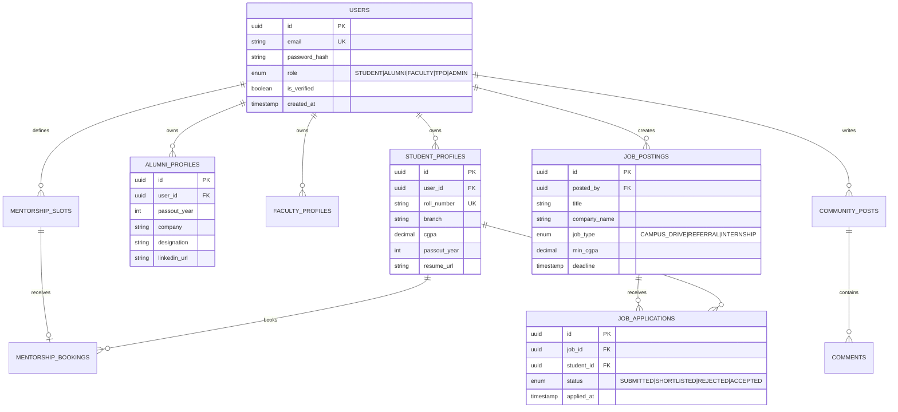

# 📊 Entity Relationship Diagram (ERD) — CampusBridge

This document defines the visual ERD layout and relational schema model for CampusBridge.

---

## 📐 ERD Diagram (Mermaid)

```mermaid
erDiagram
    USERS ||--o{ STUDENT_PROFILES : owns
    USERS ||--o{ ALUMNI_PROFILES : owns
    USERS ||--o{ FACULTY_PROFILES : owns
    
    USERS ||--o{ MENTORSHIP_SLOTS : defines
    MENTORSHIP_SLOTS ||--o| MENTORSHIP_BOOKINGS : receives
    STUDENT_PROFILES ||--o{ MENTORSHIP_BOOKINGS : books
    
    USERS ||--o{ JOB_POSTINGS : creates
    JOB_POSTINGS ||--o{ JOB_APPLICATIONS : receives
    STUDENT_PROFILES ||--o{ JOB_APPLICATIONS : submits
    
    USERS ||--o{ COMMUNITY_POSTS : writes
    COMMUNITY_POSTS ||--o{ COMMENTS : contains

    USERS {
        uuid id PK
        string email UK
        string password_hash
        enum role "STUDENT|ALUMNI|FACULTY|TPO|ADMIN"
        boolean is_verified
        timestamp created_at
    }

    STUDENT_PROFILES {
        uuid id PK
        uuid user_id FK
        string roll_number UK
        string branch
        decimal cgpa
        int passout_year
        string resume_url
    }

    ALUMNI_PROFILES {
        uuid id PK
        uuid user_id FK
        int passout_year
        string company
        string designation
        string linkedin_url
    }

    JOB_POSTINGS {
        uuid id PK
        uuid posted_by FK
        string title
        string company_name
        enum job_type "CAMPUS_DRIVE|REFERRAL|INTERNSHIP"
        decimal min_cgpa
        timestamp deadline
    }

    JOB_APPLICATIONS {
        uuid id PK
        uuid job_id FK
        uuid student_id FK
        enum status "SUBMITTED|SHORTLISTED|REJECTED|ACCEPTED"
        timestamp applied_at
    }
```
