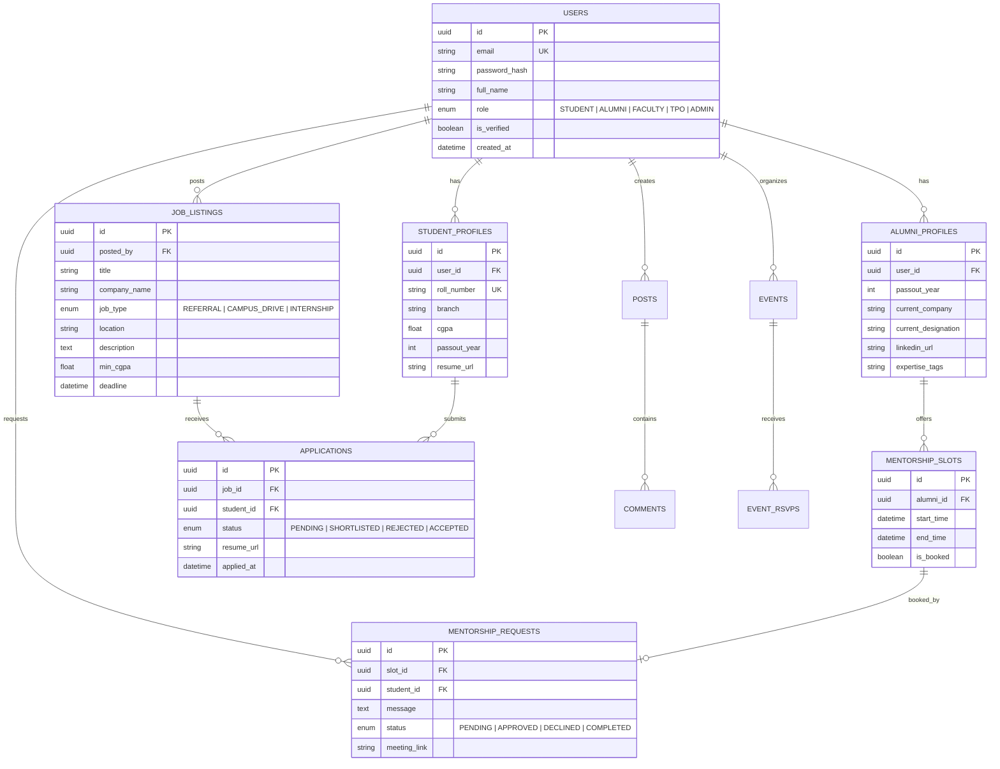

# 🗄️ Database Architecture & Design — CampusBridge

- **Database Engine**: PostgreSQL 15+
- **ORM Recommendation**: Prisma / SQLAlchemy
- **Architecture**: Relational Database with Foreign Key Constraints & Indexes

---

## 📐 Entity Relationship Diagram (ERD)



---

## 📊 Detailed Data Dictionary & Schema Specifications

### 1. `users` Table
Stores authentication and base profile details for all platform users.

| Column | Type | Constraints | Description |
| :--- | :--- | :--- | :--- |
| `id` | `UUID` | `PRIMARY KEY, DEFAULT gen_random_uuid()` | Unique user ID |
| `email` | `VARCHAR(255)` | `UNIQUE, NOT NULL` | College or professional email |
| `password_hash` | `VARCHAR(255)` | `NOT NULL` | Encrypted password string |
| `full_name` | `VARCHAR(100)` | `NOT NULL` | User's full name |
| `role` | `ENUM` | `NOT NULL` | `'STUDENT'`, `'ALUMNI'`, `'FACULTY'`, `'TPO'`, `'ADMIN'` |
| `is_verified` | `BOOLEAN` | `DEFAULT FALSE` | Verification flag |
| `avatar_url` | `VARCHAR(500)` | `NULLABLE` | Profile photo URL |
| `created_at` | `TIMESTAMP` | `DEFAULT NOW()` | Record creation timestamp |

---

### 2. `student_profiles` Table

| Column | Type | Constraints | Description |
| :--- | :--- | :--- | :--- |
| `id` | `UUID` | `PRIMARY KEY` | Profile identifier |
| `user_id` | `UUID` | `FOREIGN KEY (users.id) ON DELETE CASCADE` | Parent user |
| `roll_number` | `VARCHAR(50)` | `UNIQUE, NOT NULL` | Student institutional ID |
| `branch` | `VARCHAR(100)` | `NOT NULL` | Major/Department |
| `cgpa` | `DECIMAL(3,2)` | `CHECK (cgpa >= 0.0 AND cgpa <= 10.0)` | Current academic CGPA |
| `passout_year` | `INT` | `NOT NULL` | Expected graduation year |
| `resume_url` | `VARCHAR(500)` | `NULLABLE` | Primary resume PDF link |

---

### 3. `alumni_profiles` Table

| Column | Type | Constraints | Description |
| :--- | :--- | :--- | :--- |
| `id` | `UUID` | `PRIMARY KEY` | Profile identifier |
| `user_id` | `UUID` | `FOREIGN KEY (users.id) ON DELETE CASCADE` | Parent user |
| `passout_year` | `INT` | `NOT NULL` | Graduation year |
| `current_company` | `VARCHAR(150)` | `NOT NULL` | Current employer |
| `current_designation` | `VARCHAR(150)` | `NOT NULL` | Job role title |
| `linkedin_url` | `VARCHAR(500)` | `NOT NULL` | LinkedIn profile link |
| `expertise_tags` | `TEXT[]` | `NOT NULL` | E.g. `['Backend', 'System Design', 'FAANG']` |

---

### 4. `job_listings` Table

| Column | Type | Constraints | Description |
| :--- | :--- | :--- | :--- |
| `id` | `UUID` | `PRIMARY KEY` | Job listing identifier |
| `posted_by` | `UUID` | `FOREIGN KEY (users.id)` | User who posted (Alumni/TPO) |
| `title` | `VARCHAR(200)` | `NOT NULL` | Job title |
| `company_name` | `VARCHAR(150)` | `NOT NULL` | Hiring company |
| `job_type` | `ENUM` | `NOT NULL` | `'REFERRAL'`, `'CAMPUS_DRIVE'`, `'INTERNSHIP'` |
| `min_cgpa` | `DECIMAL(3,2)` | `DEFAULT 0.0` | Minimum required CGPA |
| `deadline` | `TIMESTAMP` | `NOT NULL` | Application cutoff time |

---

## ⚡ Key Indexes for Performance

```sql
-- Fast lookup for user login
CREATE INDEX idx_users_email ON users(email);

-- Fast filtering of job listings by type and deadline
CREATE INDEX idx_jobs_type_deadline ON job_listings(job_type, deadline);

-- Fast lookup of student applications
CREATE INDEX idx_applications_student ON applications(student_id);

-- Alumni lookup by expertise and company
CREATE INDEX idx_alumni_company ON alumni_profiles(current_company);
```
