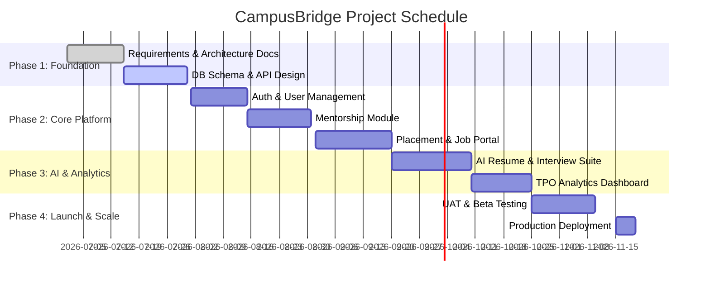

# 🗺️ Project Roadmap & Release Plan — CampusBridge

This document defines the development phases, milestones, and release schedule for CampusBridge.

---

## 📌 Release Milestones Overview

---

## 🚀 Detailed Phase Breakdown

### Phase 1: Planning & Foundation (Current)
- Complete directory setup, architecture specs, ERD schema, and API contracts.
- Initialize Next.js frontend repository and Node.js/FastAPI backend framework.

### Phase 2: Core Platform & RBAC
- Implement JWT / OAuth authentication with domain-specific verification (`@univ.edu`).
- Build Student and Alumni profile dashboards.
- Launch 1-on-1 Mentorship booking flow with email notifications.
- Launch Job & Referral Board for TPO drives and alumni job posts.

### Phase 3: AI Engine & Advanced Features
- Integrate AI Resume Reviewer API (PDF parsing + LLM analysis).
- Launch AI Mock Technical Interviewer simulator.
- Build TPO Placement Analytics dashboard with CSV export capabilities.

### Phase 4: Security Audit, Testing & Deployment
- Execute end-to-end load testing (k6) and vulnerability scanning.
- Deploy staging environment on AWS / Vercel + Railway.
- Conduct User Acceptance Testing (UAT) with pilot student & alumni group.
