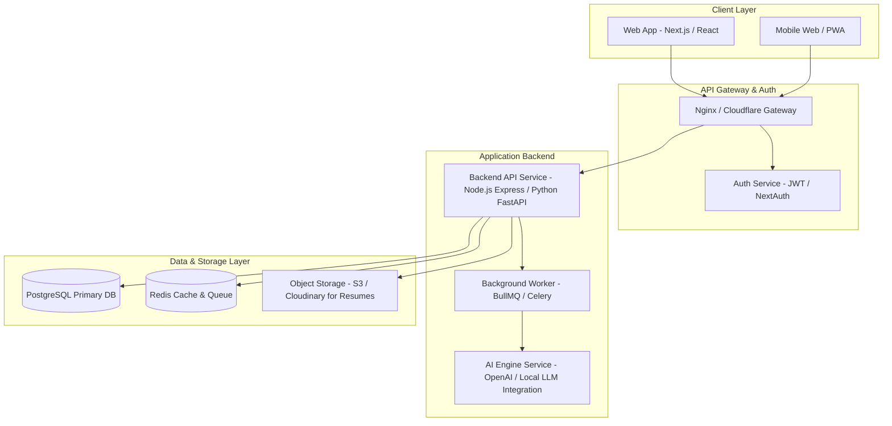

# 🏗️ System Architecture — CampusBridge

This document defines the high-level system architecture, client-server topology, data pipelines, and infrastructure layout for **CampusBridge**.

---

## 📐 System Topology Diagram

---

## 🏛️ Component Responsibilities

| Layer / Component | Technology | Responsibility |
| :--- | :--- | :--- |
| **Client Frontend** | Next.js 14 (App Router), Tailwind CSS, React Query | Renders interactive UI, handles state management, local client caching, SSR & SSG pages. |
| **API Gateway** | Cloudflare / Nginx | SSL termination, DDoS protection, rate limiting, and route reverse-proxying. |
| **Backend API** | Node.js (Express/NestJS) or FastAPI | Enforces business logic, Role-Based Access Control (RBAC), database ORM queries, validation. |
| **Background Workers** | BullMQ / Redis Workers | Processes async tasks like sending email notifications, PDF resume parsing, and cron jobs. |
| **Primary Database** | PostgreSQL 15+ | Relational data persistence with strict foreign keys, transactional integrity, and ACID guarantees. |
| **Caching Layer** | Redis | Session state, API response caching, and rate limiting counters. |
| **Object Storage** | AWS S3 / Cloudinary | Secure storage for student resumes, profile avatars, and event attachment PDFs. |
| **AI Integration** | LangChain / OpenAI API | Resume ATS scoring, alumni matching scoring, and mock interview prompt generation. |

---

## 🔒 Security & Data Isolation Architecture

1. **Authentication**: JWT tokens stored in `httpOnly`, `SameSite=Strict` secure cookies.
2. **Authorization**: Middleware-based Role Enforcement (`STUDENT`, `ALUMNI`, `FACULTY`, `TPO`, `ADMIN`).
3. **Data Protection**: Resumes stored in S3 with presigned temporary URLs to prevent unauthorized access.
4. **Rate Limiting**: API routes rate-limited to 100 requests / minute per IP.
