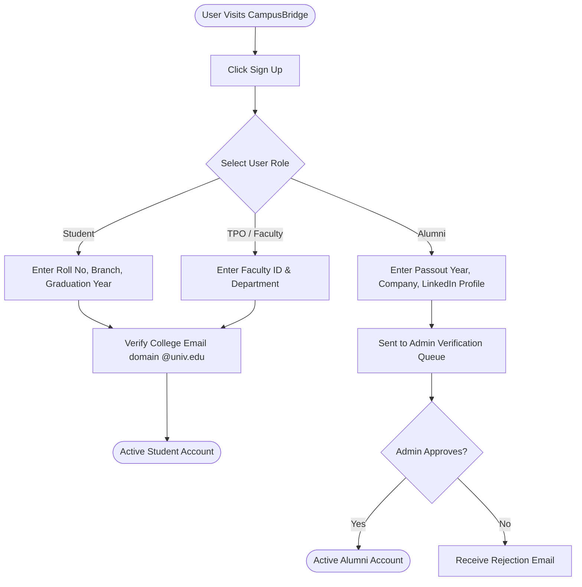
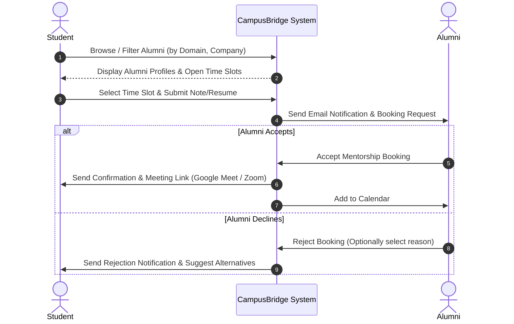
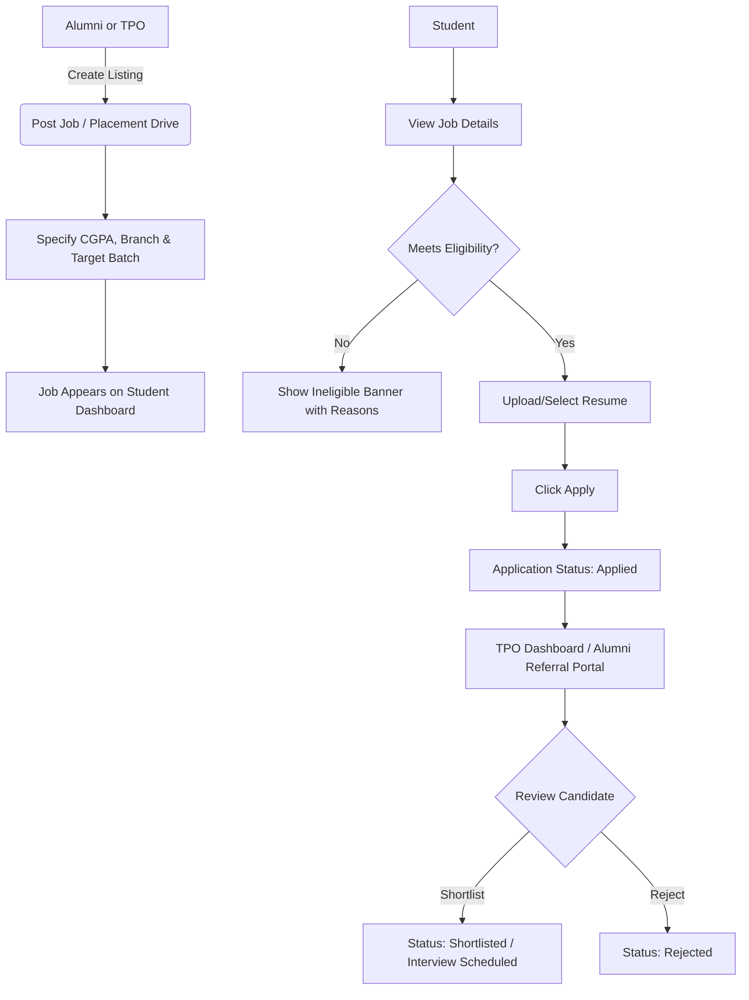

# 🔄 User Flow & Navigation Diagrams — CampusBridge

This document outlines the step-by-step navigation flows for the key user interactions across CampusBridge.

---

## 1. User Onboarding & Role Verification Flow

---

## 2. Student Mentorship Booking Flow

---

## 3. Placement Drive & Referral Application Flow

---

## 4. Discussion Forum & Community Post Flow

1. **Create Post**: User selects tag (`#InterviewExperience`, `#QnA`, `#CareerAdvice`), writes Markdown content, attaches optional images/PDFs.
2. **Moderation Check**: Automated filter scans for profanity or spam.
3. **Feed Publishing**: Published to public campus feed.
4. **Engagement**: 
   - Users upvote / downvote.
   - Alumni answers receive a highlighted **Verified Alumni** badge.
   - Author can mark an answer as **Accepted Solution**.
