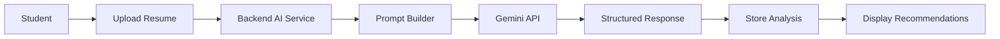
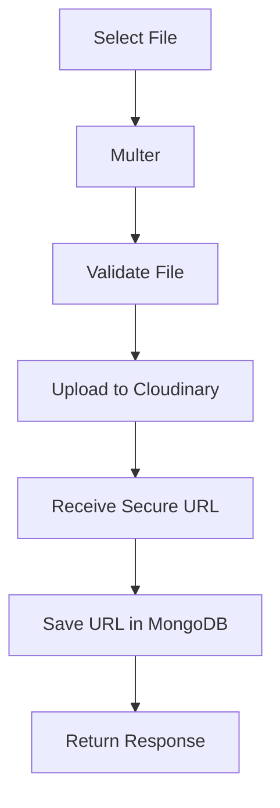

# AI Workflow Diagram

**Project:** CampusBridge

---

## Resume Analysis

```mermaid
flowchart LR

A[Student]

A --> B[Upload Resume]

B --> C[Backend AI Service]

C --> D[Prompt Builder]

D --> E[Gemini API]

E --> F[Structured Response]

F --> G[Store Analysis]

G --> H[Display Recommendations]
```

---

## File Upload

```mermaid
flowchart TD

A[Select File]

A --> B[Multer]

B --> C[Validate File]

C --> D[Upload to Cloudinary]

D --> E[Receive Secure URL]

E --> F[Save URL in MongoDB]

F --> G[Return Response]
```
