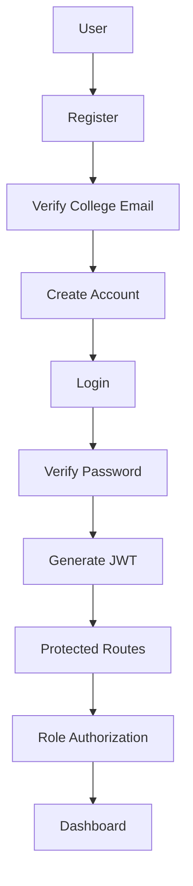

# Authentication Flow Diagram

**Project:** CampusBridge

---

```mermaid
flowchart TD

A[User]

A --> B[Register]

B --> C[Verify College Email]

C --> D[Create Account]

D --> E[Login]

E --> F[Verify Password]

F --> G[Generate JWT]

G --> H[Protected Routes]

H --> I[Role Authorization]

I --> J[Dashboard]
```
