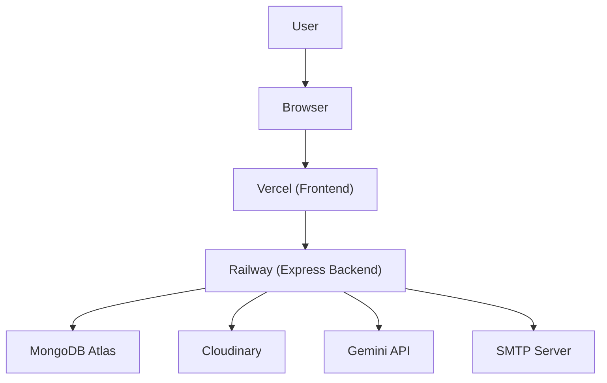

# Deployment Architecture Diagram

**Project:** CampusBridge

---

```mermaid
flowchart TD

User --> Browser

Browser --> Vercel["Vercel (Frontend)"]

Vercel --> Railway["Railway (Express Backend)"]

Railway --> MongoDB["MongoDB Atlas"]

Railway --> Cloudinary

Railway --> Gemini["Gemini API"]

Railway --> SMTP["SMTP Server"]
```
