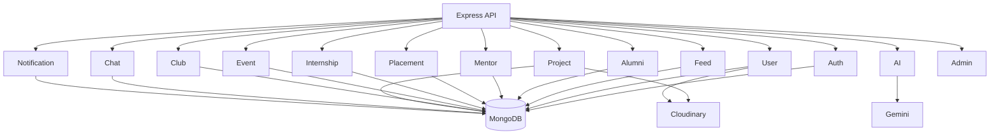
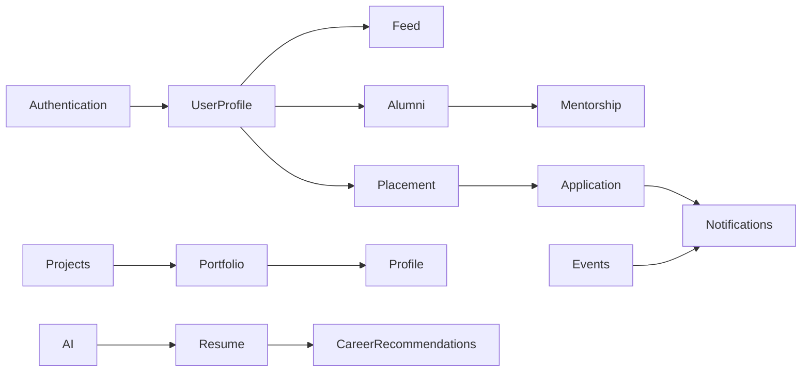

# Module Architecture Diagram

**Project:** CampusBridge

---

## Backend Modules

```mermaid
flowchart TB

API[Express API]

API --> Auth
API --> User
API --> Feed
API --> Alumni
API --> Mentor
API --> Placement
API --> Internship
API --> Event
API --> Club
API --> Project
API --> Chat
API --> Notification
API --> AI
API --> Admin

Auth --> DB[(MongoDB)]
User --> DB
Feed --> DB
Alumni --> DB
Mentor --> DB
Placement --> DB
Internship --> DB
Event --> DB
Club --> DB
Project --> DB
Chat --> DB
Notification --> DB

AI --> Gemini
Project --> Cloudinary
User --> Cloudinary
```

---

## Core Module Relationships

```mermaid
graph LR

Authentication --> UserProfile

UserProfile --> Feed

UserProfile --> Alumni

Alumni --> Mentorship

UserProfile --> Placement

Placement --> Application

Application --> Notifications

Projects --> Portfolio

Portfolio --> Profile

Events --> Notifications

AI --> Resume

Resume --> CareerRecommendations
```
