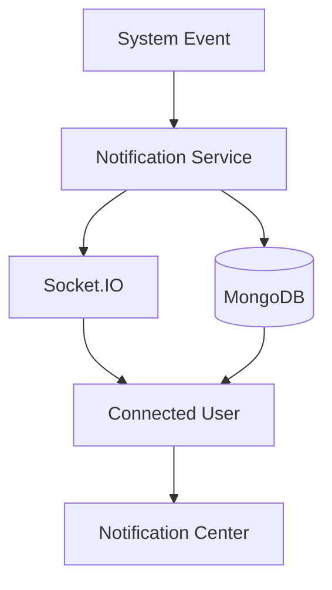
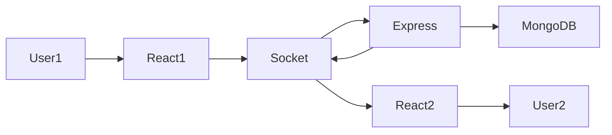

# Notification Flow Diagram

**Project:** CampusBridge

---

## Notification Delivery

```mermaid
flowchart TD

A[System Event]

A --> B[Notification Service]

B --> C[(MongoDB)]

B --> D[Socket.IO]

D --> E[Connected User]

C --> E

E --> F[Notification Center]
```

---

## Real-Time Chat

```mermaid
flowchart LR

User1 --> React1

React1 --> Socket

Socket --> Express

Express --> MongoDB

Express --> Socket

Socket --> React2

React2 --> User2
```
