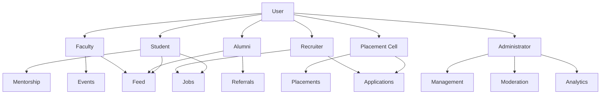

# Role-Based Access Control Diagram

**Project:** CampusBridge

---

```mermaid
graph TD

User --> Student
User --> Faculty
User --> Alumni
User --> Recruiter
User --> PlacementCell["Placement Cell"]
User --> Administrator

Student --> Feed
Student --> Jobs
Student --> Mentorship

Alumni --> Referrals
Alumni --> Feed

Faculty --> Events
Faculty --> Feed

PlacementCell --> Placements
PlacementCell --> Applications

Recruiter --> Jobs
Recruiter --> Applications

Administrator --> Management
Administrator --> Moderation
Administrator --> Analytics
```
