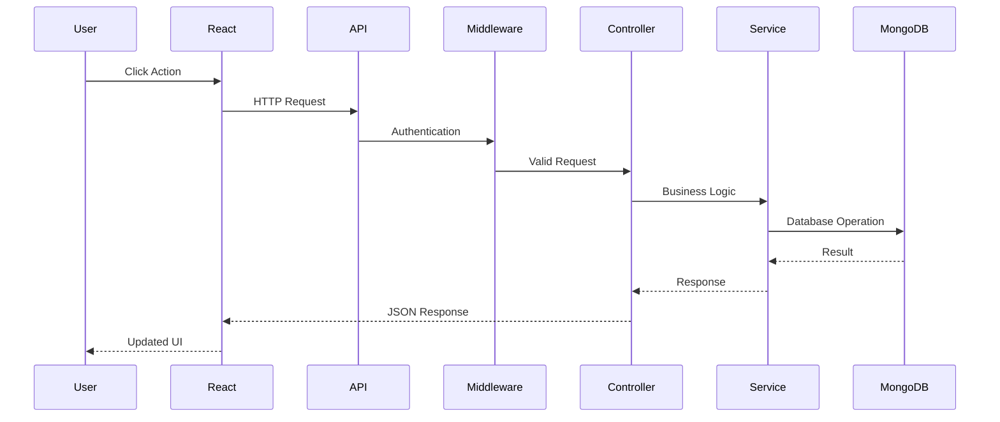

# Request Flow Diagram

**Project:** CampusBridge

---

```mermaid
sequenceDiagram

participant User

participant React

participant API

participant Middleware

participant Controller

participant Service

participant MongoDB

User->>React: Click Action

React->>API: HTTP Request

API->>Middleware: Authentication

Middleware->>Controller: Valid Request

Controller->>Service: Business Logic

Service->>MongoDB: Database Operation

MongoDB-->>Service: Result

Service-->>Controller: Response

Controller-->>React: JSON Response

React-->>User: Updated UI
```
