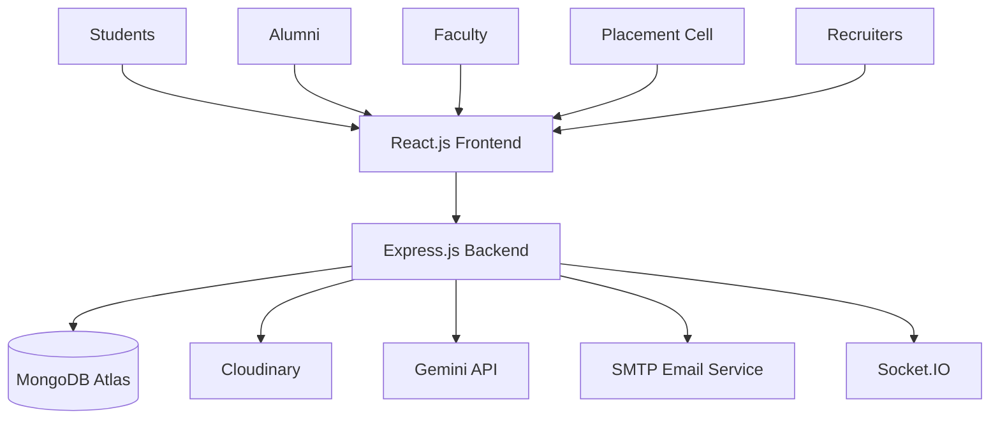

# System Architecture Diagram

**Project:** CampusBridge

---

```mermaid
flowchart TD

A[Students]
B[Alumni]
C[Faculty]
D[Placement Cell]
E[Recruiters]

A --> F
B --> F
C --> F
D --> F
E --> F

F[React.js Frontend]

F --> G[Express.js Backend]

G --> H[(MongoDB Atlas)]

G --> I[Cloudinary]

G --> J[Gemini API]

G --> K[SMTP Email Service]

G --> L[Socket.IO]
```
